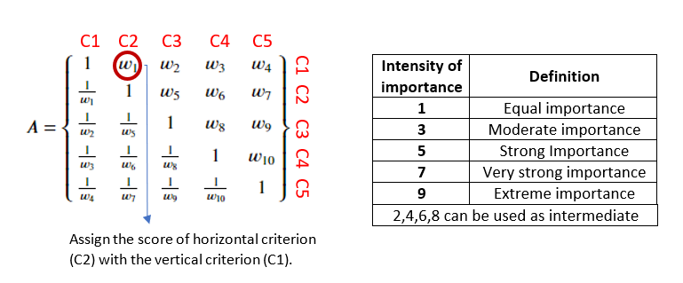
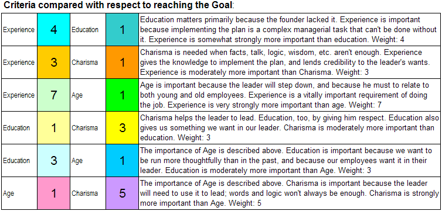
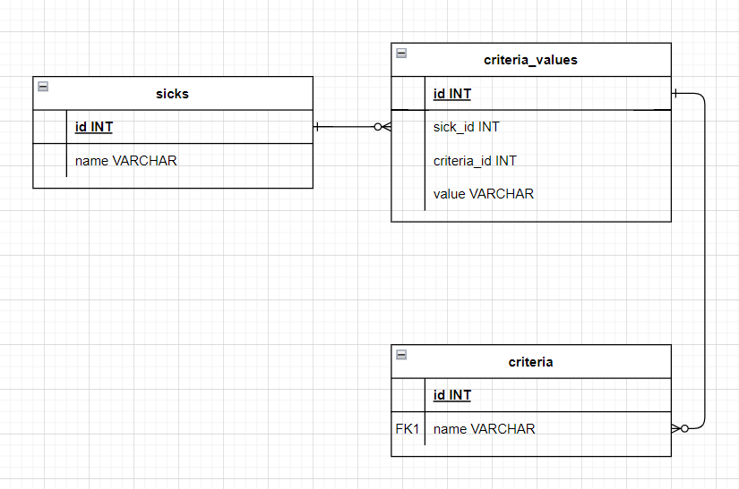
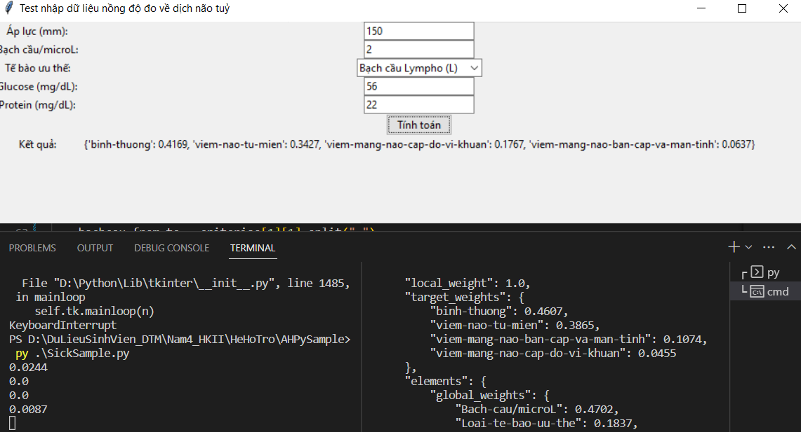

# AHPSample

#### Installing AHPy

AHPy is available on the Python Package Index ([PyPI](https://pypi.org/)):

```
python -m pip install ahpy
```
AHPy requires [Python 3.7+](https://www.python.org/), as well as [numpy](https://numpy.org/) and [scipy](https://scipy.org/).

## Table of Contents

[Use AHPy](#sử-dụng-ahpy)

[Purchasing car](#purchasing-car)

[Dịch não tuỷ (folder `test`)](#dịch-não-tuỷ-folder-test)

## Sử dụng ahpy



### Nhập ma trận

Theo như trong hình, ta chỉ cần nhập lần lượt w1, w2, ..., wn.
Ví dụ như ở dưới hình này



Thì câu lệnh nhập trong ahpy như sau:

```python
>>> criteria_comparisons = {('Experience', 'Education'): 4, ('Experience', 'Charisma'): 3, ('Experience', 'Age'): 7,
			    ('Education', 'Charisma'): 1/3, ('Education', 'Age'): 3,
			    ('Charisma', 'Age'): 5}
```
### Kết quả

Câu lệnh trong python in ra kết quả.

```python
>>> criterial = ahpy.Compare('Criteria', criterial_comparisons, precision=3)
>>> report = criterial.report(show=True)
```

## Purchasing car

[Nguồn sưu tập trên wiki](https://en.wikipedia.org/wiki/Analytic_hierarchy_process_%E2%80%93_car_example)

## Dịch não tuỷ (folder `./test`)

### Cách làm

#### So sánh từng cặp tiêu chí với mục tiêu 

Sau khi đánh giá (chủ quan), thì dưới đây là kết quả:
|Tiêu chí|Trọng số|
|:-:|:-:|
|Áp lực (mm)* |0.0315|
|Bạch cầu/microL*|0.4702|
|Loại tế bào ưu thế|0.1837|
|Glucose (mg/dL)|0.1454|
|Protein(mg/dL)*|0.1692|

#### So sánh từng cặp phương án theo Tiêu chí

Dựa theo kết quả nhập chỉ số đo được mà ta tính ra kết quả

### Database (SQLite3)

Sử dụng mô hình EAV để lưu data



#### Tạo CSDL

Đầu tiên chạy file `./test/sqlite3/init.py` để tạo table `sicks`, `criteria` và `criteria_value` - nếu chưa có file `tutorial.db`.
Có một vài mẫu query truy vấn trong `./test/sqlite3/query.py`

### Chạy demo (file `./SickSample.py`)

Chỉ số nhất quán (CR) của mỗi tiêu chí (bài cho 5 tiêu chí) sẽ hiển thị ở console.
Kết quả hiển thị trên giao diện. Ví dụ như sau:


