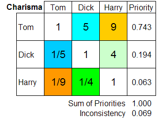

# AHPSample

#### Installing AHPy

AHPy is available on the Python Package Index ([PyPI](https://pypi.org/)):

```
python -m pip install ahpy
```
AHPy requires [Python 3.7+](https://www.python.org/), as well as [numpy](https://numpy.org/) and [scipy](https://scipy.org/).

## Table of Contents

[Use AHPy](#sử-dụng-ahpy)
[Purchasing car](#purchasing-car)

## Sử dụng ahpy


### Nhập ma trận

Theo như trong hình, ta chỉ cần nhập lần lượt w1, w2, ..., wn. 

Ví dụ như ở dưới hình này



Thì câu lệnh nhập trong ahpy như sau:

```python
>>> criteria_comparisons = {('Experience', 'Education'): 4, ('Experience', 'Charisma'): 3, ('Experience', 'Age'): 7,
			    ('Education', 'Charisma'): 1/3, ('Education', 'Age'): 3,
			    ('Charisma', 'Age'): 5}
```
### Kết quả

Câu lệnh trong python in ra kết quả.

```python
>>> criterial = ahpy.Compare('Criteria', criterial_comparisons, precision=3)
>>> report = criterial.report(show=True)
```

## Purchasing car

 [Nguồn sưu tập trên wiki](https://en.wikipedia.org/wiki/Analytic_hierarchy_process_%E2%80%93_car_example)
